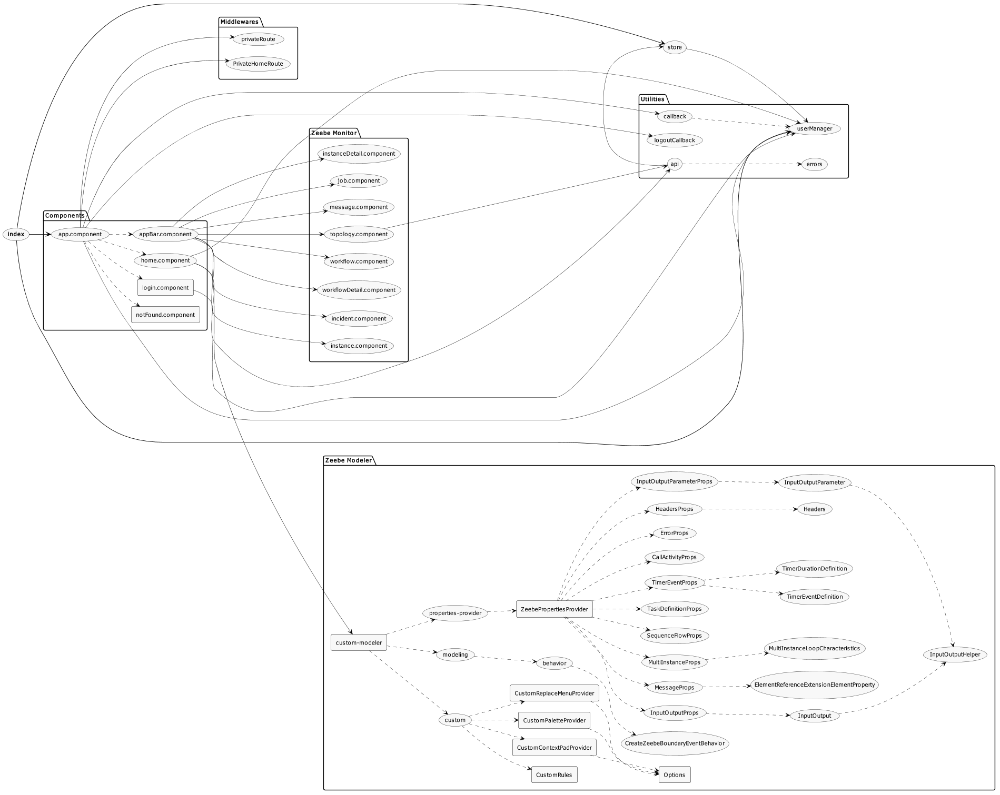

Zeebe Manager Frontend
==========================

A React web application for [Zeebe](https://zeebe.io) with user authentication. It is designed to

* build and configure workflow models using BPMN 2.0 (`Zeebe Modeler`)
* deploy a workflow and save a BPMN diagram in local Git repository [(`Zeebe Manager back-end`)](http://10.207.1.10/eai/zeebe/zeebe-manager-be)
* monitoring Zeebe and workflow execution [(`Zeebe Monitor`)](http://10.207.1.10/eai/zeebe/zeebe-monitor-be)


## Architecture diagram



## Install
### Docker
The docker image for the worker is published to [Nexus Giottolabs](https://repo.eai.giottolabs.com)

```
docker pull docker.eai.giottolabs.com/zeebe-manager-fe:0.26.0
docker run -d --name zeebemanagerfe -p 80:80 docker.eai.giottolabs.com/zeebe-manager-fe:0.26.0
```


* ensure that a Zeebe broker is running
* ensure that [`Zeebe Manager back-end`](http://10.207.1.10/eai/zeebe/zeebe-manager-be) is running
* ensure that [`Zeebe Monitor`](http://10.207.1.10/eai/zeebe/zeebe-monitor-be) is running
* ensure that [`WSO2 Identity Server`](https://docs.wso2.com/display/IS570/Running+the+Producte) is running


### Configuration

The configuration can be changed via`config.js` file.
By default, the port is set to `4000`.

```js
window.ENV={
	"REACT_APP_API":"https://apigw-dev.prb.regione.campania.it/zeebe-manager",
	"REACT_APP_TASK_API":"https://apigw-dev.prb.regione.campania.it/usertask",
	"REACT_APP_SIMPLE_MONITOR":"https://apigw-dev.prb.regione.campania.it/zeebe-monitor",
	"REACT_APP_DOMAIN_FE":"https://zeebe-manager-dev.prb.regione.campania.it" ,
	"REACT_APP_CLIENT_ID":"dQCGz0GEDhgTqHGqtb6Wd2eHg04a",
	"REACT_APP_CLIENT_SECRET":"yqHZtgg1UNxrIZsIQ1gmd7ani5Ya",
	"REACT_APP_REDIRECT_URI":"https://zeebe-manager-dev.prb.regione.campania.it/callback",
	"REACT_APP_POST_LOGOUT_REDIRECT_URI":"https://zeebe-manager-dev.prb.regione.campania.it/logoutCallback",
	"REACT_APP_AUTHORITY":"https://is-dev.prb.regione.campania.it/oauth2/oidcdiscovery",
	"REACT_APP_SILENT_REDIRECT_URI":"https://zeebe-manager-dev.prb.regione.campania.it/silent_renew.html" ,
	"REACT_APP_ROLE":"ZEEBE_MANAGER"
}
```

* ``REACT_APP_API`` = Zeebe Manager back-end
* ``REACT_APP_SIMPLE MONITOR`` = Zeebe Monitor back-end
* ``REACT_APP_CLIENT_ID`` and ``REACT_APP_CLIENT_SECRET`` = WSO2 IS Service Provider OAuth2 keys
* ``REACT_APP_DOMAIN_FE``,``REACT_APP_REDIRECT_URI``,``REACT_APP_POST_LOGOUT_REDIRECT_URI`` and ``REACT_APP_SILENT_REDIRECT_URI`` = callback URLs of Service Provider
* ``REACT_APP_ROLE`` = represents the user role that identifies admin, 
it must be set on WSO2 Identity Server

    * **for the correct functioning of the zeebe git repository make sure that the user has an e-mail in the id_token**

All other properties refer to [WSO2 Identity Server setting](https://docs.wso2.com/display/IS570/Configuring+OAuth2-OpenID+Connect).

### Change Configuration Files
You can use docker volumes to link your own configuration files inside the container. For example if you want to change the **config.js**:
```
docker run -d --name zeebemanagerfe -p 80:80 \
           -v $PWD/config.js:/usr/local/apache2/htdocs/config.js \
           docker.eai.giottolabs.com/zeebe-manager-fe:0.26.0
```

## Documentation

All documentation can be found on <http://10.207.1.10/eai/zeebe/zeebe-manager-fe/wikis/Zeebe-Manager-Versions>.

## Contributing

Please refer to [Contributing to GitLab page](http://10.207.1.10/eai/zeebe/zeebe-manager-fe/blob/master/CONTRIBUTING.md) for more details.


